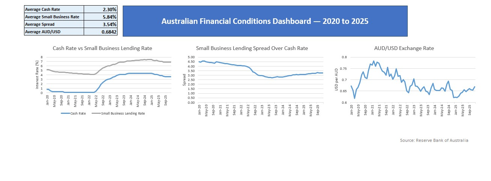

# Australian Financial Conditions Dashboard

Excel and Power Query analysis of Australian financial conditions using Reserve Bank of Australia data from 2020 to 2025.

## Project Overview

This project looks at how Australian financial conditions changed between 2020 and 2025.

The analysis focuses on:

- RBA cash rate movements
- Small business lending rates
- The spread between the cash rate and small business lending rates
- AUD/USD exchange rate movements

The data was cleaned and combined in Power Query before being analysed and visualised in Excel.

## Tools Used

- Microsoft Excel
- Power Query
- Pivot/analysis formulas
- Excel charts

## Data Source

Source: Reserve Bank of Australia

RBA Statistical Tables used:

- F1.1 - Interest Rates and Yields – Money Market
- F7 - Business Lending Rates
- F11 - Exchange Rates

## Dashboard

## Key Findings

- The cash rate remained very low through 2020 and 2021 before increasing sharply from 2022.
- Small business lending rates increased alongside the cash rate, although they remained consistently higher.
- The spread between the small business lending rate and cash rate narrowed significantly during the rate-hiking period.
- AUD/USD was strongest around 2021 before generally weakening over the following years.

## Data Preparation

Power Query was used to:

- import data from multiple RBA workbooks
- remove metadata and unnecessary columns
- standardise data types
- filter the analysis period to 2020–2025
- create a common monthly date field
- merge cash rate, lending rate and exchange rate datasets

A calculated spread was then created:

`Small Business Lending Rate - Cash Rate`

## Files

- `Australian_Financial_Conditions_Analysis.xlsx` - Excel workbook containing the Power Query transformations, analysis and dashboard
- `Australian_Financial_Conditions_Analysis.jpg` - dashboard preview
- `Australian_Financial_Conditions_Analysis.pdf` - dashboard PDF
